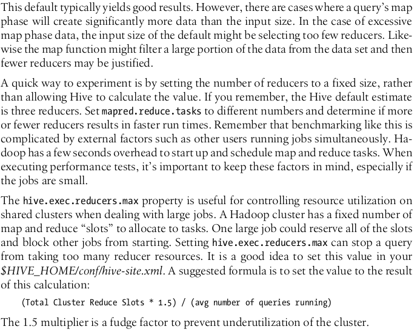

# hive_interview_preparation

## Theorical Questions Section

### Theorical Question 1

Do hive have OLTP features ?

<b>Answer</b>

<b>Source</b>

programming hive

### Theorical Question 2

Why jive could misinterpret data ?

<b>Answer</b>

When you write data to a traditional database, either through loading external data,
writing the output of a query, doing UPDATE statements, etc., the database has total
control over the storage. The database is the “gatekeeper.” An important implication
of this control is that the database can enforce the schema as data is written. This is
called schema on write.

Hive has no such control over the underlying storage. There are many ways to create,
modify, and even damage the data that Hive will query. Therefore, Hive can only en-
force queries on read. This is called schema on read.

So what if the schema doesn’t match the file contents? Hive does the best that it can to
read the data. You will get lots of null values if there aren’t enough fields in each record to match the schema. If some fields are numbers and Hive encounters nonnumeric
strings, it will return nulls for those fields. Above all else, Hive tries to recover from all errors as best it can.

<b>Source</b>

programming hive

### Theorical Question 3

What commands would you use in hive if givena table you want to get info about:

- Partition Information
- Retention
- Location
- Compressed

<b>Answer</b>

DESCRIBE FORMATTED

<b>Source</b>

https://docs.cloudera.com/HDPDocuments/HDP3/HDP-3.0.1/materialized-view/content/hive_describe_materialized_view.html

### Theorical Question 4

What is the difference between managed/internal tables and external tables ?

<b>Answer</b>

The tables we have created so far are called managed tables or sometimes called inter-
nal tables, because Hive controls the lifecycle of their data (more or less). As we’ve seen, Hive stores the data for these tables in a subdirectory under the directory defined by hive.metastore.warehouse.dir (e.g., /user/hive/warehouse), by default.
When we drop a managed table  Hive deletes the data in the table.

<b>Source</b>

programming hive

### Theorical Question 5

When would you use the hive command ALTER TABLE ... ADD PARTITION ?

<b>Answer</b>

ALTER TABLE ... ADD PARTITION is not limited to external tables. You can use it with
managed tables, too, when you have (or will have) data for partitions in directories
created outside of the LOAD and INSERT options we discussed above. You’ll need to
remember that not all of the table’s data will be under the usual Hive “warehouse”
directory, and this data won’t be deleted when you drop the managed table! Hence,
from a “sanity” perspective, it’s questionable whether you should dare to use this fea-
ture with managed tables.

<b>Source</b>

programming hive

### Theorical Question 6

How can you recover a deleted managed deleted table ?

<b>Answer</b>

if you enable the Hadoop Trash feature, which is not on by
default, the data is moved to the .Trash directory in the distributed
filesystem for the user, which in HDFS is /user/$USER/.Trash. To enable
this feature, set the property fs.trash.interval to a reasonable positive
number. It’s the number of minutes between “trash checkpoints”; 1,440
would be 24 hours. While it’s not guaranteed to work for all versions of
all distributed filesystems, if you accidentally drop a managed table with
important data, you may be able to re-create the table, re-create any
partitions, and then move the files from .Trash to the correct directories
(using the filesystem commands) to restore the data.

<b>Source</b>

programming hive

### Theorical Question 7

How can you specify that the location of a table changed ?

<b>Answer</b>

you can change a partition location, effectively moving it:
ALTER TABLE log_messages PARTITION(year = 2011, month = 12, day = 2)
SET LOCATION 's3n://ourbucket/logs/2011/01/02';

This command does not move the data from the old location, nor does it delete the old
data.
Finally, you can drop a partition:

ALTER TABLE log_messages DROP IF EXISTS PARTITION(year = 2011, month = 12, day = 2);
The IF EXISTS clause is optional, as usual. For managed tables, the data for the partition is deleted, along with the metadata, even if the partition was created using ALTER TABLE ... ADD PARTITION . For external tables, the data is not deleted.

<b>Source</b>

programming hive

### Theorical Question 8

How do we load data into hive ?

<b>Answer</b>

Since Hive has no row-level insert, update, and delete operations, the only way to put
data into an table is to use one of the “bulk” load operations. Or you can just write files in the correct directories by other means.

LOAD DATA LOCAL INPATH '${env:HOME}/california-employees'
OVERWRITE INTO TABLE employees
PARTITION (country = 'US', state = 'CA');

This command will first create the directory for the partition, if it doesn’t already exist, then copy the data to it. If the target table is not partitioned, you omit the PARTITION clause.

If the LOCAL keyword is used, the path is assumed to be in the local filesystem. The data is copied into the final location. If LOCAL is omitted, the path is assumed to be in the distributed filesystem. In this case, the data is moved from the path to the final location.

INSERT OVERWRITE TABLE employees
PARTITION (country = 'US', state = 'OR')
SELECT * FROM staged_employees se
WHERE se.cnty = 'US' AND se.st = 'OR';

The INSERT statement lets you load data into a table from a query. Reusing our employ
ees example from the previous chapter, here is an example for the state of Oregon,
where we presume the data is already in another table called staged_employees . For
reasons we’ll discuss shortly, let’s use different names for the country and state fields in staged_employees , calling them cnty and st , respectively:

There’s still one problem with this syntax: if you have a lot of partitions to create, you have to write a lot of SQL! Fortunately, Hive also supports a dynamic partition feature, where it can infer the partitions to create based on query parameters. By comparison, up until now we have considered only static partitions.

INSERT OVERWRITE TABLE employees
PARTITION (country, state)
SELECT ..., se.cnty, se.st
FROM staged_employees se;

<b>Source</b>

programming hive

### Theorical Question 9

When should you use indexes in hive ?

<b>Answer</b>

Hive has limited indexing capabilities. There are no keys in the usual relational database sense, but you can build an index on columns to speed some operations. 

The index data for a table is stored in another table.
Also, the feature is relatively new, so it doesn’t have a lot of options yet. However, the indexing process is designed to be customizable with plug-in Java code, so teams can
extend the feature to meet their needs.

Indexing is also a good alternative to partitioning when the logical partitions would
actually be too numerous and small to be useful. Indexing can aid in pruning some
blocks from a table as input for a MapReduce job. Not all queries can benefit from an
index—the EXPLAIN syntax and Hive can be used to determine if a given query is aided
by an index.

Indexes in Hive, like those in relational databases, need to be evaluated carefully.
Maintaining an index requires extra disk space and building an index has a processing
cost. The user must weigh these costs against the benefits they offer when querying a
table.

<b>Source</b>

programming hive

### Theorical Question 10

How would you activate parallel mode hive ?

<b>Answer</b>

<b>Source</b>

programming hive

### Theorical Question 11

Number of mappers and reducers ?

<b>Answer</b>

<b>Source</b>

programming hive

